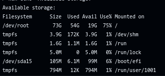
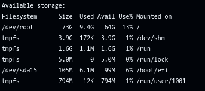

# Remove component in GitHub runner

> **THIS IS ONLY TESTED ON GITHUB-HOSTED UBUNTU-22.04 RUNNER AND CAN RUN ONLY ON GITHUB-HOSTED UNBUNTU RUNNER.
> PLEASE DON'T RUN ON WINDOWS OR MACOS OR SELF-HOSTED. 
> IF YOU RUN ON SELF-HOSTED ALTHOUGH YOU HAD BEEN WARNED, I DON'T TAKE ANY RESPONSIBILITY ABOUT YOUR LOST DATA**

## Why I made this?

Ughh!!!Default GitHub ubuntu runner have 73GB, but they installed too much thing i unused, The space only have 14GB[^1].
So I read how image created [^2] and wrote a script to remove what I don't need, and It works better than I expected :)

| Before remove everything |  After removed everything (~6 mins)   |
|:------------------------:|:-------------------------------------:|
|       |                |
|    _Too little space_    | _Like a new installed ubuntu machine_ |

## So, How to use?

1. First paste this to your job's step:
    ```yaml
    steps:
      - name: Remove unused components
        uses: ngocptblaplafla/more-space-plz@v1
        with:
    ```
   for better experiments, put it first
2. Add components you want to remove like this
    ```yaml
      - name: Remove unused components
        uses: ngocptblaplafla/more-space-plz@v1
        with:
          android-sdk: true 
    ```
3. Now you can run workflows

## What components it can remove?

Here the list: 

- aliyun: Remove aliyun
- android-sdk: Remove android-sdk
- apache: Remove apache
- aws-tools: Remove aws-tools
- azcopy: Remove azcopy
- azure-cli: Remove azure-cli
- azure-devops-cli: Remove azure-devops-cli
- bazel: Remove bazel
- bicep: Remove bicep
- clang: Remove clang
- cmake: Remove cmake
- codeql-bundle: Remove codeql-bundle
- container-tools: Remove container-tools
- docker: Remove docker
- docker-data: Remove docker-data
- dotnet: Remove dotnet
- erlang: Remove erlang, removed in 22.04
- firefox: Remove firefox
- gcc-compilers: Remove gcc-compilers
- gfortran: Remove gfortran
- github-cli: Remove github-cli
- git-lfs: Remove git-lfs
- git: Remove git
- google-chrome: Remove google-chrome
- google-cloud-cli: Remove google-cloud-cli
- golang: Remove golang
- haskell: Remove haskell
- heroku: Remove heroku
- hhvm: Remove hhvm, removed in 22.04
- homebrew: Remove homebrew
- java-tools: Remove java-tools
- julia: Remove julia
- kotlin: Remove kotlin
- kubernetes-tools: Remove kubernetes-tools
- leiningen: Remove leiningen
- man: Remove manual, doc, info
- microsoft-edge: Remove microsoft-edge
- miniconda: Remove miniconda
- mongodb: Remove mongodb, removed in 22.04
- mono: Remove mono
- mssql-tools: Remove mssql-tools
- mysql: Remove mysql
- nginx: Remove nginx
- nodejs: Remove nodejs
- nvm: Remove nvm
- oc-cli: Remove oc-cli
- oras-cli: Remove oras-cli
- packer: Remove packer
- phantomjs: Remove phantomjs, removed in 22.04
- php: Remove php
- pipx-packages: Remove pipx-packages
- postgresql: Remove postgresql
- powershell: Remove powershell
- pulumi: Remove pulumi
- pypy: Remove pypy
- python: Remove python
- rlang: Remove rlang
- ruby: Remove ruby
- rust: Remove rust
- sbt: Remove sbt
- selenium: Remove selenium
- snap: Remove snap
- sqlpackage: Remove sqlpackage
- swap: Remove swap
- swift: Remove swift
- terraform: Remove terraform
- vcpkg: Remove vcpkg
- yq: Remove yq
- zstd: Remove zstd

Just pick the thing you unused, don't pick too much Or do something like: 

> "I removed `python` but `pipx` (don't run)||(removed)"

> Why you want to have `pipx` running, although you have removed `python`?

So don't ask me why there is no option for remove all things.

[^1]: https://docs.github.com/en/actions/writing-workflows/choosing-where-your-workflow-runs/choosing-the-runner-for-a-job#standard-github-hosted-runners-for-public-repositories
[^2]: https://github.com/actions/runner-images/tree/main/images/ubuntu